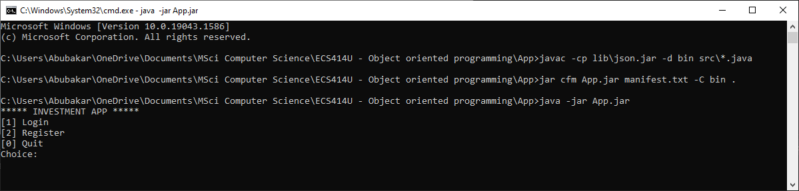
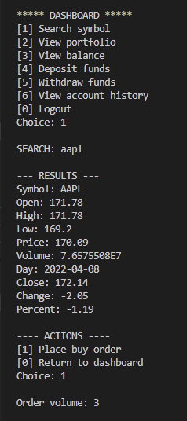
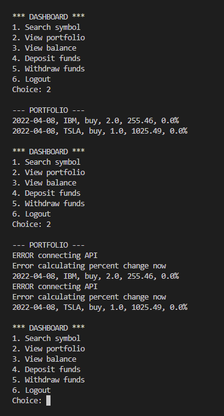
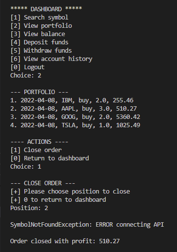

# Investment Trading Simulator

### Description

This program simulates an investment trading application where a user can place trades using real-time data. The program simulates a stock market where securities such as stocks, currencies and crypto can be bought and sold.

The stock, currency and crypto classes have not been utilised at present as I am still researching the differences between these securities. For examples, a user should be able to place buy and sell orders on currency pairs but should only be limited to a buy order on stocks. These features will be implemented at a later stage once I have a more comprehensive understanding of the subtle differences.

### Features

+ View portfolio
+ Deposit and withdraw funds
+ Login as a client
+ Register as a new client
+ Manage client accounts as a manager
+ View real-time market data
+ Buy and sell securities
+ Save portfolio and transaction data

### Dependencies

+ org.json

### Edge Cases

* Managers can be assigned to managers
* 

## To Do

* Client must approve to be under a manager account
* Change password option
* Create sell order for currency pairs
* Create GUI to limit enforce input validation
  * Plot piechart to visualise open positions
  * Create function to plot timeseries for a security
* Update historical transaction data to match closing date and profit to initial order using a database
* Create option to place take profit and stop loss orders

## Build Instructions



In order to compile and run the program, you will need to open the command line from the App folder and do the following:

Compile the program files using javac

````
javac -cp lib\json.jar;lib\javax.jar -d bin src\*.java
````

Create an executable jar file

````
jar cfm App.jar manifest.txt -C bin .
````

Run the compiled jar file

````
java -jar App.jar
````

## Usage



The user is presented with options that they can select from the dashboard. Some options may offer further actions which the user can select. At each stage, the user is provided with an option to return to the dashboard and cancel the action.

### Additional Notes



You may experience some issues with the 'View portfolio' option. This is due to the fact that this option creates new API calls to calculate the appreciation or depreciation of your portfolio by retrieving the current price for each stock in your portfolio.

To prevent this issue from occuring, please wait a few seconds before choosing an option that requires an API call or upgrade to the premium API.



In some instances where the user attempts to close an open position, the API call may fail resulting in a miscalculation of the profit for that position. In the example above, we can see that

To prevent this issue from occuring, please wait a few seconds before choosing an option that requires an API call or upgrade to the premium API.

## Marking Scheme

**Level 1** (10 marks)

* Standard I/O (keyboard input and printing to terminal).
* Good design, making sensible use of classes and objects.

**Level 2** (10 marks)

* Sensible use of inheritance, making use of Java's features such as abstract classes and interfaces where necessary.
* Sensible use of polymorphism.

**Level 3** (10 marks)

* Use of ArrayLists or other classes from Java's Collection Framework.
* Adequate exception handling.
* Graphical User Interface.
* File I/O for features requiring permanent storage.

**Extra** (5 marks)

* Add something special. Do your own research and use programming concepts that go beyond what you have seen in class.

## Helpful Links

[Alpha Vantage API Documentation](https://www.alphavantage.co/documentation/)

[Compiling and running Java programs using the command line](https://www.codejava.net/java-core/tools/how-to-compile-package-and-run-a-java-program-using-command-line-tools-javac-jar-and-java)
